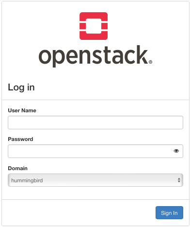
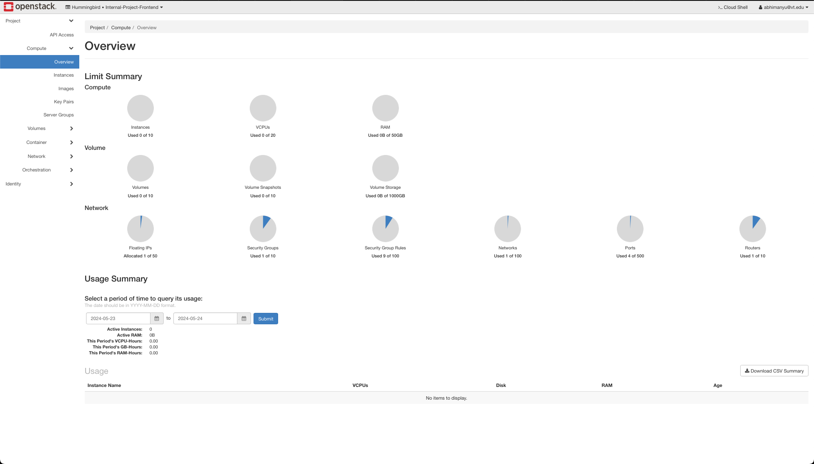
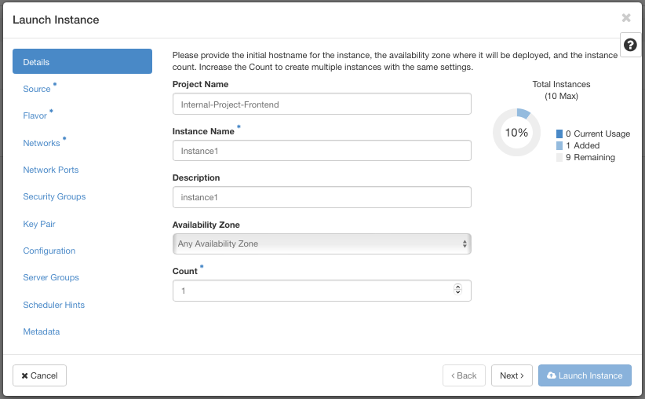
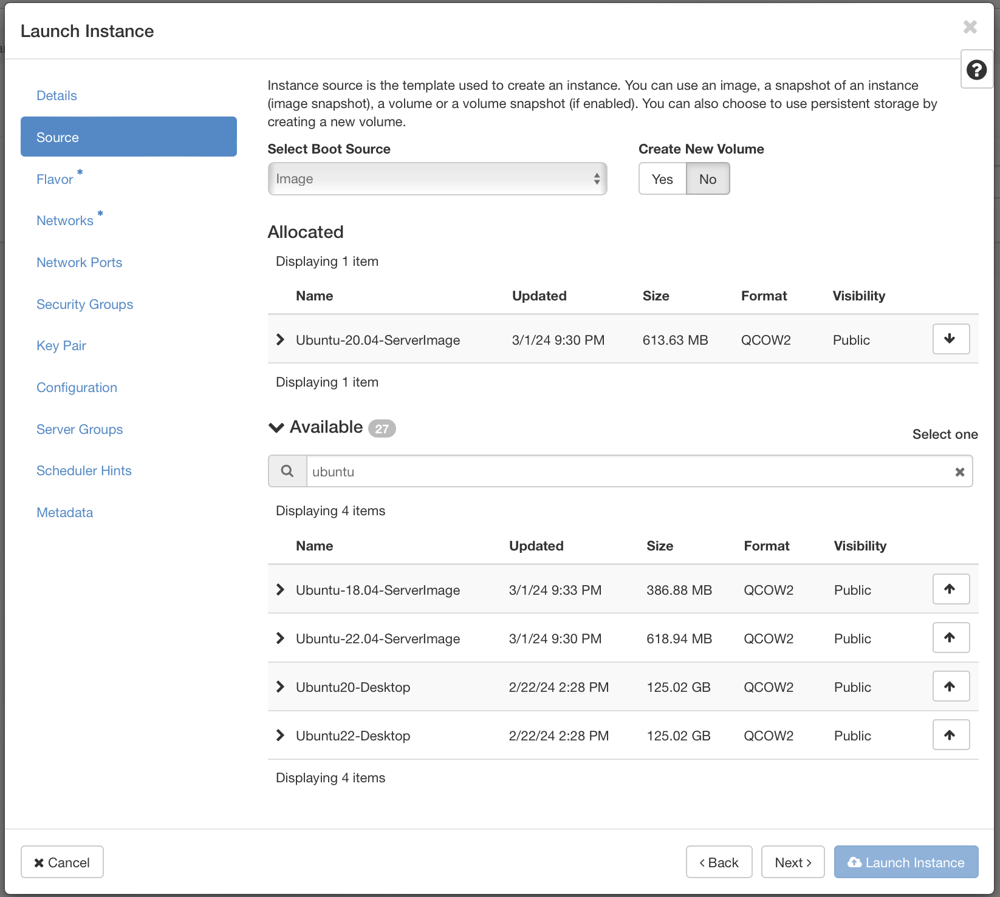

CCI xG Testbed OPENSTACK
============================

This is a testbed for CCI xG project. It is based on OpenStack and uses the following components:

**Login Page**
--------------

Login page

**Dashboard**
--------------

Dashboard

Launch Instance
===============

This is the "Launch Instance" screen from our cloud management dashboard. It allows you to configure and provision new virtual machine instances within our cloud environment.

|

**Project Name**
~~~~~~~~~~~~~~~~~
Select the project name from the left panel.

**Instance Name**
~~~~~~~~~~~~~~~~~~
Provide a name for the instance. This field is required.

**Description**
~~~~~~~~~~~~~~~~~~
Optionally, provide a description for the instance.

**Availability Zone**
~~~~~~~~~~~~~~~~~~~~~~
Choose the availability zone from the dropdown. Select "Any Availability Zone" if no specific zone is required.

**Count**
~~~~~~~~~~
Specify the number of instances to launch. Default is 1. This field is required

**Source**
-----------

Instance source is the template used to create an instance. You can use an image, a snapshot of an instance (image snapshot), a volume, or a volume snapshot (if enabled). You can also choose to use persistent storage by creating a new volume.

|

|

**Select Boot Source**
~~~~~~~~~~~~~~~~~~~~~~~~

 - **Image:** Select an image from the "Deploying Items" list below.
 - **Snapshot:** Select a snapshot of an existing instance.
 - **Volume:** Select a volume snapshot, if enabled.

 Optionally, choose whether to create a new volume from the source.

.. note::
   Select "NO"  for Create New Volume if you want to use the source volume as the boot volume.

**Allocated**
--------------

The "Ubuntu-20.04-ServerImage" image is allocated

.. note::
   Displays currently allocated items. Initially this will show "Displaying 0 items".

**Selected Image**
~~~~~~~~~~~~~~~~~~

The "Ubuntu-20.04-ServerImage" was chosen because:
 - It's a recent version of Ubuntu, released in April 2020.
 - The "Server" image is optimized for use on servers, without a desktop environment.
 - Ubuntu 20.04 is a Long Term Support (LTS) release, meaning it will receive updates and support for an extended period.

This makes it a stable, efficient choice for running a server instance.

